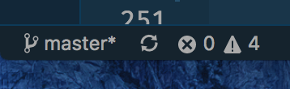

# INFO 448 Mobile Development Android

## About this guide

This repository aims to provide invaluable tips, advice, and resources in alignment with what's being presented during lecture. After each lecture or a homework has been assigned, come check out this repo for some good gotchas!

Something interesting you want to point out or let me cover on, submit an issue to this repository. Or, send me an email: **naruthk@uw.edu**.

---

## Table of Content

<!-- TOC -->

- [INFO 448 Mobile Development Android](#info-448-mobile-development-android)
  - [About this guide](#about-this-guide)
  - [Table of Content](#table-of-content)
  - [Topics](#topics)
    - [Kotlin Basic](#kotlin-basic)
    - [Kotlin Style Guide](#kotlin-style-guide)
    - [Android Core Concepts](#android-core-concepts)
    - [Lecture: Going Beyond](#lecture-going-beyond)
    - [Homework Hints](#homework-hints)
    - [Lab Meetings](#lab-meetings)
    - [Libraries](#libraries)
      - [Dagger 2](#dagger-2)
      - [Firebase](#firebase)
      - [React Native](#react-native)
      - [Flutter](#flutter)
      - [RxJava](#rxjava)
    - [Resources](#resources)
      - [Articles/Websites on Android Development](#articleswebsites-on-android-development)
      - [Core Documentation](#core-documentation)
      - [Videos/Courses](#videoscourses)
      - [Editors](#editors)
        - [IntelliJ IDEA](#intellij-idea)
        - [Android Studio](#android-studio)
        - [VS COde](#vs-code)
      - [Testing Your Application / Code](#testing-your-application--code)
      - [Publishing Your Application to the Google Play Store](#publishing-your-application-to-the-google-play-store)
      - [Popular Open-Source Android Apps](#popular-open-source-android-apps)
    - [Common Questions](#common-questions)
      - [Troubleshooting](#troubleshooting)
      - [Common Git Issues](#common-git-issues)

<!-- /TOC -->

---

## Topics

### Kotlin Basic

In progress.

---

### Kotlin Style Guide

- Kotlinlang.org's [Coding Conventions](https://kotlinlang.org/docs/reference/coding-conventions.html): It offers the current coding style guide for the Kotlin language.
- Android's [Kotlin Style guide](https://android.github.io/kotlin-guides/style.html): Google's very own style guide for writing Kotlin for Android development
- Ray Wenderlich's [Kotlin Style Guide](https://github.com/raywenderlich/kotlin-style-guide): Another recommended one. Beyond his style guide, he posts lots of useful content on Kotlin too.

---

### Android Core Concepts

- [Activities](concepts/Activities.md)
- Adapters
- [Android](concepts/Android.md)
- Android Emulator
- Android Manifest
- [Architecture](concepts/Architecture.md)
- APK
- Components
- Concurrency
- Fragments
- [Gradle](concepts/Gradle.md)
- Graphics
- Intents
- [Instant Run](concepts/Instant_Run.md)
- [Kotlin](concepts/Kotlin.md)
- Layouts
- Location
- Logging (Debugging)
- Material Design
- MVP (Model-View-Presenter)
- Permissions
- Providers
- Resources
- Storage
- Views
- [XML](concepts/XML.md)

---

### Lecture: Going Beyond

- Week 1: March 27th and 29th
  - Takeaway:
    - Install Android Studio (3.0 or above), Android 4.0 (Kitkat) for SDK, and an emulator of choice
    - Windows user and looking for a way to connect your Android phone to Android Studio? Install [OEM driver](https://developer.android.com/studio/run/oem-usb.html).
- Week 2: April 3rd and 5th
  - Links:
    - Callicoders - [Kotlin's Inheritance](https://www.callicoder.com/kotlin-inheritance/)
    - Callicoders - [Kotlin's Classes, Objects, Constructors, Initializers](https://www.callicoder.com/kotlin-classes-objects-constructors-initializers/)
- Week 3:
  - April 10th
    - Activity Lifecycle: [Link](http://developer.android.com/guide/components/activities.html)
    - `log`, its levels, and the `logcat`
    - How toasts are created and used
    - How notification works and are programmed
    - Making alerts!
  - April 12th
    - Android Example - [Layout examples](https://androidexample.com/LAYOUTS/index.php?view=examplecloud&scat=11)
    - Tutorials Point - [User Interface Layouts](https://www.tutorialspoint.com/android/android_user_interface_layouts.htm)
    - Best practices when it comes to [organizing XML files](https://github.com/futurice/android-best-practices#resources)
    - Try this! Udacity's [Android Visualizer](https://labs.udacity.com/android-visualizer/#/android/sandbox)
    - [Advance `findViewById`](https://medium.com/@quiro91/improving-findviewbyid-with-kotlin-4cf2f8f779bb) thanks to Kotlin
- Week 4:
  - April 17th
    - Model-View-Controller (Basic architecture we're asking you to based your structure on): [Android Architectural Pattern 1](https://medium.com/upday-devs/android-architecture-patterns-part-1-model-view-controller-3baecef5f2b6)
    - Advance MVC - [List of Common Patterns](https://www.raywenderlich.com/168038/common-design-patterns-android-kotlin)
    - MVC Siblings (MVP, MVVM, etc.): [A thorough analysis of their differences](https://academy.realm.io/posts/eric-maxwell-mvc-mvp-and-mvvm-on-android/)
  - April 19th
    - [Implementing `TabHost` in Android](https://www.viralandroid.com/2015/09/simple-android-tabhost-and-tabwidget-example.html)
    - ListView and GridView:
      - These require you to implement `Adapters` and `AdapterView` for them to function properly.
      - In easy terms, think of an **Adapter** is the person that works behind the scenes to tell the ListView what to display and what data to fetch. The **AdapterView** is the Adapter’s boss. So the hierarchy goes like this: `ListView` <- `AdapterView` <- `Adapter` <- `Data` !
    - RecyclerView is also fundamental! But, it comes with a steep learning curve.
- Week 5:
  - April 24th
    - [Intents](https://developer.android.com/reference/android/content/Intent.html)
    - [Dialogs](https://developer.android.com/guide/topics/ui/dialogs.html)
      - An `AlertDialog` has been the fundamental way to creating dialogs for many years.
      - But you can also implement a Custom `Dialog` class (but this involves using `Fragments` at some point)
    - Fragments - [Official documentation](https://developer.android.com/guide/components/fragments.html)
      - Source of GitHub repo that Ted uses to teach Fragment: [CW-Omnibus - Dynamic Fragment Demo](https://github.com/commonsguy/cw-omnibus/tree/master/Fragments/Dynamic)
      - Make sure to understand its lifecycle (yes it closely resembles an Activity's lifecycle too!)
      - Two things you need to create fragments are:
        - XML for its layout AND a class that implements `Fragment`
      - Understand the [Performing Fragment](https://developer.android.com/guide/components/fragments.html#Transactions) Transactions section from the documentation
      - Examples & Tutorials:
        - [Kotlin's Simple Fragment Example](https://github.com/kmvignesh/Fragment)
        - Beyond scope of this class - [Implementing a Custom `FragmentManager` to reduce errors when dealing with fragment transaction](https://medium.com/thoughts-overflow/how-to-add-a-fragment-in-kotlin-way-73203c5a450b)
        - [Step-by-step tutorial for creating fragments](https://www.techotopia.com/index.php/An_Introduction_to_Kotlin_Android_Fragments)
        - [Using Fragments in Android](https://www.techotopia.com/index.php/Using_Fragments_in_Android_Studio_-_A_Kotlin_Example) - The example involves creating and using a Tab bar, which is not what we have taught you yet.

---

### Homework Hints

Aside from external links that you might be finding useful to help you tackle through the homework assignments, there are also coding/concept hints to lead you to the correct direction.

- Homework 1: **Hello, World**
- Homework 2: **Simple Kotlin**
  - Running test script: 
    - `kotlinc -script main.kts`
    - Before running the code, make sure you are inside the directory in which your `main.kts` file is stored.
    - See troubleshooting questions at the bottom of this page for more details if you've discovered an error running the script file.
  - `debugString`:
    - Make sure you understand the purpose of this read-only String.
    - [Getters and Setters - Koltin](https://kotlinlang.org/docs/reference/properties.html)
- Homework 3: **Complex Kotlin**
  - Running test script:
    - `kotlinc -script main.kts`
    - Before running the code, make sure you are inside the directory in which your `main.kts` file is stored.
  - Woring with higher-order functions and lambdas:
    - [Higher-Order Functions and Lambdas - Kotlin Programming Language](https://kotlinlang.org/docs/reference/lambdas.html)
      - Take note of things like `invocation`, `lambda expressions`, `anonymous functions`, `passing a lambda to the last parameter`.
    - [Higher-order function - Wikipedia](https://en.wikipedia.org/wiki/Higher-order_function)
    - [Programmer Dictionary: Higher Order Function](https://blog.kotlin-academy.com/programmer-dictionary-higher-order-function-9cadb07df94e)
      - The author provides useful examples of how to use functions such as `.map {}` and `.filter {}` that might be beneficial for you
  - Note the difference between `listOf(12..20)` and `listOf(12,13,14,15,16,17,18,19,20)` and just plain `(12..20)`. Find out their differences.
  - Fizzbuzz puzzle? [What is the FizzBuzz puzzle?](http://wiki.c2.com/?FizzBuzzTest)
  - Repeating strings? The `repeat(x)` function might be useful in certain cases.
  - Enumerators: [Enum Classes - Kotlin](https://kotlinlang.org/docs/reference/enum-classes.html)
  - `.invoke()` function: [Invoke - Kotlin](https://kotlinlang.org/docs/reference/operator-overloading.html#invoke)
  - Stackoverflow - [Why .fold() and why not .reduce()?](https://stackoverflow.com/questions/44429419/what-is-basic-difference-between-fold-and-reduce-in-kotlin-when-to-use-which)
- Homework 4: **Activity Spy**
  - [Android's `Log`](https://developer.android.com/reference/android/util/Log.html)
    - Make sure you know how the `Log` is called and used.
  - [Activity Lifecycle](https://developer.android.com/guide/components/activities/activity-lifecycle.html)
    - Make sure you have a sense of how each event, namely `onCreate`, `onStop`, and particularly `onDestroy`, is triggered. The assignment asks that the `onDestroy` event is triggered and that this event is produced in the log file.
  - [Debugging `LogCat`](http://developer.android.com/tools/debugging/debugging-log.html)
    - Commands:
      - `adb logcat`: Runs logcat
      - `adb logcat -f file`: Writes to file
- Homework 5: **Tip Calculator** (Due April 17)
  - Make sure you know how to parse a `String` into a `Double`
  - `findViewById<T>(R.id.name_of_object) as T` in important part to remember!
  - Kotlin's `onClickListener` is different from that of Java. Make sure that the syntax is right!
- Homework 6: **Life Counter** (Due April 19)
  - Make sure you understand how each layout in Android works in order to "equally balanced" the app on each device.
  - A good approach for solving orientation issues is to use [Constraint Layout](https://developer.android.com/training/constraint-layout/index.html)!
  - There are lots of ways to solve the layout issue. You can, if you want to, nest Linear Layouts inside a Relative Layout that is acting as a parent element. Whatever you choose, make sure it fits the design that you're trying to achieve.
- Homework 7-10 (QuizDroid):
  - Intent:
    - `Intents` are used to go from one Activity to another and they also allow you to pass data in the process.
    - Many ways are available for you to pass an object (`String`, `ArrayList`, and etc.) to another Activity!
  - Fragments:
    - Learn more about them before diving into the code itself. Lots of resources are provided (see the [Lecture: Going Beyond](#lecture-going-beyond) section)
    - See section's slide on Apr 25th (Week 5) to learn more about Fragments.

---

### Lab Meetings

- Week 1: March 28th
  - Slides: [Week 1](https://slides.com/naruthkongurai/info448-android-w1)
  - Main Takeaway:
    - Introduction to section
    - Getting to know each other
    - How each section meeting will be run
- Week 2: April 4th
  - Slides: [Week 2](https://slides.com/naruthkongurai/info448-android-w2)
  - Main Takeaway:
    - Genymotion and Vysor
    - Kotlin Syntax and Functions
- Week 3: April 11th (Cancelled)
- Week 4: April 18th
  - Slides: [Week 4](http://slides.com/naruthkongurai/info448-android-w4)
  - Main Takeway:
    - Model-View-Controller (MVC)
    - Model-View-Presenter (MVP)
    - Different layouts in Android (Relative Layout, Linear Layout, Constraints Layout, etc.)
    - [Website for all-things ConstriantLayout](https://constraintlayout.com)
      - Get started [here](https://constraintlayout.com/basics/create_constraint.html)
      - Offers tutorials on how to work with ConstraintLayout, what properties such as `Constriant Bias`, `Margin`, `Padding`, and `Barrier` are
- Week 5: April 25th
  - Slides: [Week 5](https://slides.com/naruthkongurai/info448-android-w5) 

---

### Libraries

#### Dagger 2

In progress.

#### Firebase

In progress.

#### React Native

Before diving in to what React Native really is, read this article I've written on [Native vs. Non-native Apps](articles/Native_Non-native.md)

In progress.

#### Flutter

In progress.

#### RxJava

In progress.

---

### Resources

#### Articles/Websites on Android Development

- [Learning android development](https://android.jlelse.eu/learning-android-development-e2d4d239a7a3)
  - Meant for people starting Android Development, or anyone needing more resources and foundation to go on and make great apps
- [Android Development Best Practices](https://blog.mindorks.com/android-development-best-practices-83c94b027fd3)
  - Best practices in designing and developing Android apps
  - Cover topics like Model-View-Controller, unit testing, debugging tools, HTTP library, Fragments, RxJava
- Professor Joel Ross's [Android Development: Lecture Notes](https://info448-s17.github.io/lecture-notes/) are super great and useful, but I think it's a bit too formal and technical. He teaches this course many times before.

#### Core Documentation

- [Android Development Documentation](https://developer.android.com/guide/index.html)
- [Kotlin Documentation](https://kotlinlang.org/docs/)
- [Java API Documentation](http://docs.oracle.com/javase/8/docs/api/)

#### Videos/Courses

- YouTube - [Android App Development for Beginners Playlist](https://www.youtube.com/playlist?list=PL6gx4Cwl9DGBsvRxJJOzG4r4k_zLKrnxl)
  - Really good basic-to-intermediate introduction to Android development.
- Udemy - [60 Minutes with Kotlin for Developers](https://www.udemy.com/kotlin-for-developers)
  - You'll have to paid for this course, but it does a really good job of getting right to the point and explaining all the important bits you'll need to master Kotlin in just an hour.

#### Editors

##### IntelliJ IDEA

In progress.

**Setting up:**

**Plugins:**

##### Android Studio

In progress.

**Setting up:**

**Plugins:**

##### VS COde

In progress.

#### Testing Your Application / Code

In progress.

#### Publishing Your Application to the Google Play Store

In progress.

#### Popular Open-Source Android Apps

In progress.

---

### Common Questions

#### Troubleshooting

**Hey Sam, I've uploaded my solution to my GitHub repo. But how do I test what I've uploaded to make sure it's working?**

That's easy! Clone the repo to a new directory. Now build the app. If you're working on an Android app, then test the app using one of your emulators.

There's a catch! When you open an existing Android project in Android Studio, sometimes you will need to press the `Sync with Gradle` button in order for the project to actually be properly running. Otherwise, your app might not run!

**I'm using VS Code for one of the assignments. Where's the Integrated Terminal I saw you and Ted used during lecture?**

You can reach the Integrated Terminal in two ways:

1. If in your VS code, you can’t find the Integrated Terminal panel,  head to `View` -> `Integrated Terminal`

2. Click on either the circular X symbol or the triangular Warning symbol. Then switch to the `Terminal` tab.

You're set! Now you can run the exact bash script inside this terminal.

**The test script isn't working! What do I do?**

If, for instance, `kotlinc` isn’t installed, then you’ll have to find a way to install it first.

For Mac, do it through Homebrew:
1. Make sure Homebrew is updated: `brew update`
2. Install Kotlin compiler: `brew install kotlinc`

For Windows machines, refer to the [official installation guide](https://kotlinlang.org/docs/tutorials/command-line.html).

---

#### Common Git Issues

**What do I do when I get this error: `Updates were rejected because the remote contains work that you do not have locally. This is usually caused by another repository pushing`?**

When you created your repository, there happens to be a `README.md` file already inside of it. And so when you do a `git push`, git will not allow you to do it. That’s because you are trying to push something locally that is “behind” what’s inside the remote repository.

To fix the problem, a simple way is to delete that repo from GitHub. Create a new one of the same name (but this time, don’t let GitHub create a README file for you). Then follow Ted’s instruction to re-route your remote URL, and `git push` should work.

**Do you suggest using a GUI for connecting and utilizing GitHub or should I stick with using the command line interface?**

How you want to upload it to GitHub is entirely up to you. For me personally, I’d rather tick with the command line interface (but it's my preference).

As long as your code solution is able to be uploaded to GitHub's cloud servers, everybody is happy.