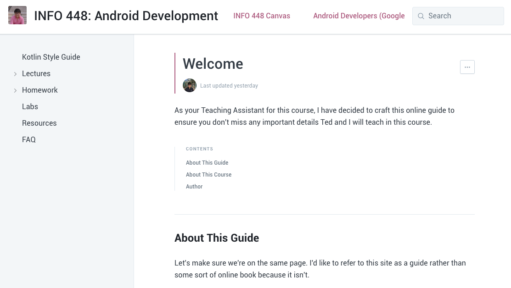

# INFO 448 Mobile Development Android

## Welcome

To access the guide for this course, please visit this [link](https://uw-info448.gitbook.io/info-448-android-development/).

The guide is a very helpful tool for students taking Informatics 448: Android Development. The guide provides tips, advices, and resources in alignment with what's being presented during lecture.

If you want me to add any additional information, send me an email: **naruthk@uw.edu**.
